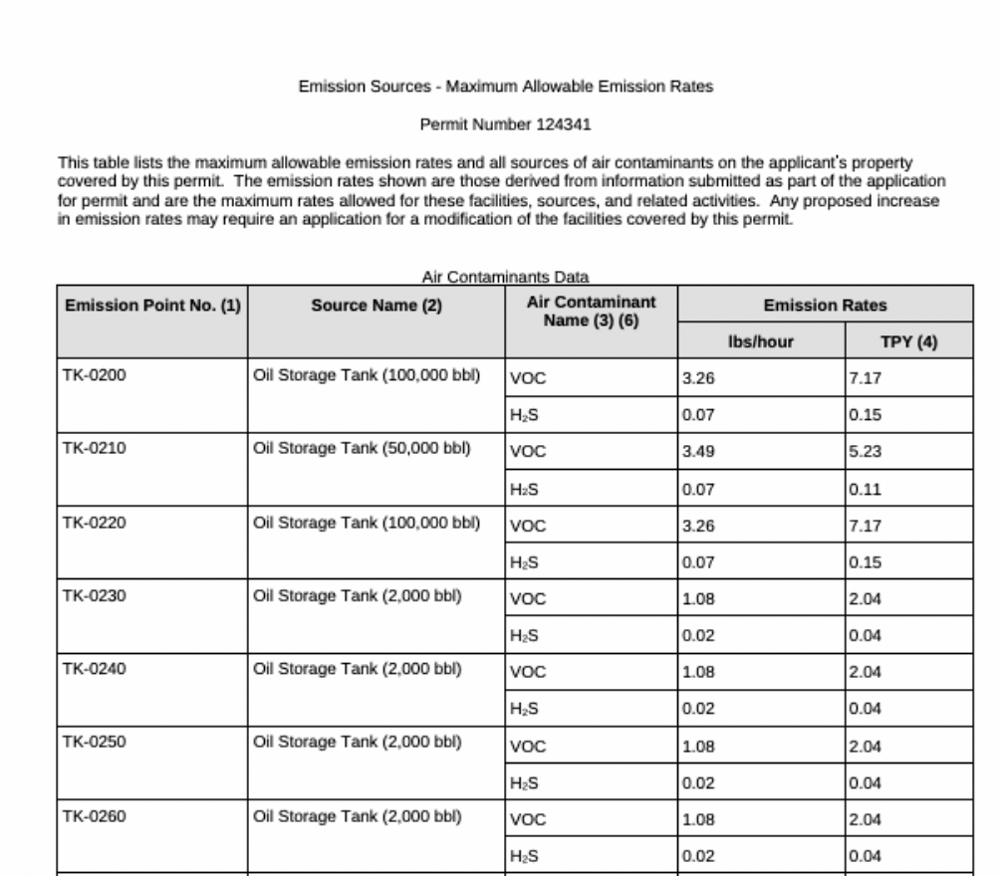

# Texas Air Permits: Extracting Maximum Allowable Emissions Rate Tables

This repository aims to extract maximum allowable emissions rate tables (MAERTs) from all publicly-available "air new source permits" published by the Texas Commission on Environmental Quality (TCEQ). The data was last refreshed on April 5, 2024.

For general documentation, read this [FAQ](https://docs.google.com/document/d/1dJIYn_4FDi1xqVX2ouW0tIdX0m9RxJCeMvTg_j1kJ8w/edit?usp=sharing). For technical documentation, read below.

## Overview

### What are Maximum Allowable Emissions Rate Tables (MAERTS)?

Maximum Allowable Emissions Rate Tables (MAERTs) are a key component of air permits issued by the Texas Commission on Environmental Quality (TCEQ). Any business or entity involved in activities—such as manufacturing, fuel combustion, construction, or other operations—that may impact air quality must obtain an air permit from the TCEQ.

Per air permit application, the TCEQ evaluates potential emissions and sets maximum allowable emissions for pollutants. The result is a MAERT. The limits in these tables ensure compliance with air quality standards under the Texas Clean Air Act and federal regulations. Non-compliance with the maximum allowable emissions set by the TCEQ can result in fines, penalties, or shutdowns.

### What is the process behind extracting MAERTs from Texas air permits?

The TCEQ stores air permit PDFs in an online database that requires specific filters to retrieve results. It’s useful for finding individual documents by address, Regulated Entity Name (organization or individual filing for permits), or RN (an 11-digit unique ID for facility locations). However, it is not ideal for mass downloading of files by category. 

Our process is as follows:

1. Compile a list of Regulated Entity Names and RNs by searching [TCEQ’s Regulated Entity Search](https://www15.tceq.texas.gov/crpub/index.cfm?fuseaction=regent.RNSearch) database, using all of Texas’ counties and zip codes as search criteria. 
2. For each RN, scrape the TCEQ’s document portal for “new source review permit” PDFs.
3. Extract the MAERT from the PDFs as standardized, structured data.

### What data are you providing?

We have provided three resources: 

- data/combined_entities.csv
    - This is a list of all Regulated Entity Names, RNs, and other metadata as of the last scrape date, created from the first step of the process.
- data/MAERT_lookup.csv
    - This file is a lookup table for all scraped MAERTs in data/MAERT. Note: A Regulated Entity may have multiple MAERTs (e.g., a business or individual may apply for air permits multiple times), and a RN may have multiple MAERTs (e.g., a site could have several associated air permits).
- data/final.csv.zip
    - This file is the output of the MAERT extraction process, compressed due to Github’s [large file storage limitations](https://docs.github.com/en/repositories/working-with-files/managing-large-files/about-large-files-on-github). It contains all MAERTs for the scraped RNs, standardized into a single, large table.
 
### What potential uses are there for this data? 
These datasets can help answer important questions about air pollution, regulation, and environmental impacts in Texas. These are a few ideas for how it might be used. If you end up working with this data, the Data Liberation Project would love to hear from you!

**Environmental Justice & Public Health**: Who is most exposed to pollution — and where?
- Map permitted emission limits alongside demographic data (like race, income, or health outcomes).
- Identify neighborhoods with especially high concentrations of permitted pollution.

**Corporate Accountability**: Who’s polluting the most and how has that changed over time?
- Rank companies or industries by total permitted emissions.
- Track changes over time for specific companies or facilities.
- Link facilities with high MAERTs to environmental violations, fines, or lawsuits.

## Data Dictionary 
 All definitions were sourced from [TCEQ’s guidance page](https://www.tceq.texas.gov/permitting/central_registry/guidance.html) (see “TCEQ Core Data Form Instructions” document). 

### `data/combined_entities.csv`

| column name             | description                                                                                                                                                                                                                                                      |
| ----------------------- | ---------------------------------------------------------------------------------------------------------------------------------------------------------------------------------------------------------------------------------------------------------------- |
| `rn_number`             | Each site location is issued a unique 11-digit identification number called an RN (e.g. RN123456789).                                                                                                                                                           |
| `regulated_entity_name` | A “Regulated Entity” is a person, organization, place, or thing that is of environmental interest to TCEQ where regulatory activities of interest to the Agency occur or have occurred in the past. Examples are a site, facility or license. |
| `county`                | The county where the Regulated Entity is located. If there is more than one county, provide the primary county in which the majority of the Regulated Entity is located.                                                                                         |
| `location`              | Address of the Regulated Entity or if the physical location has no street address, then specific directions to reach the Regulated Entity                                                                                                                         |

### `data/MAERT_lookup.csv`

| column name              | description                                                                                            |
| ------------------------ | ------------------------------------------------------------------------------------------------------ |
| `rn_number`              | Each site location is issued a unique 11-digit identification number called an RN (e.g., RN123456789). |
| `permit_number`          | Permit Number of MAERT                                                                                 |
| `publish_date`           | Publish Date as listed in the Document Portal M-D-YYYY                                                 |
| `relative_file_location` | Location of named MAERT PDF relative to repository                                                           |

### `data/final.csv.zip`

| column name | description |
|-------------------------|-----------------------------------------------------------------------------------------------------------------------------------------------------------------------------------------------------------------------------------------------------------------------------------------------------------------------------------------------------------------------------------------------------------------------------------------------------------------------------------------------------------------------------------------------------------------------------------------------------------------------------------------------------------------------|
| Emission Source | Either specific equipment designation or emission point number (EPN) from plot plan. |
| Source Name | Specific point source name |
| Air Contaminant Name | Below is an example of possible values. Specific values will vary. <ul> <li> CO - carbon monoxide </li> <li> NOx - total oxides of nitrogen </li> <li> PM10 - particulate matter equal to or less than 10 microns in diameter. Where particulate matter is not listed, it shall be assumed that no particulate matter greater than 10 microns in emitted. </li> <li> SO2 - sulfur dioxide </li> <li> VOC - volatile organic compounds as defined in Title 30 Texas Administrative Code § 101. </li> <li> CO - carbon monoxide </li> <li> CO - carbon monoxide </li> </ul> |
| Emission Rate lbs/hr | The allowable emission rates listed for individual source in lbs/hr |
| Emission Rate tons/year | The allowable emission rates listed for individual source in tons/year |
| rn_number | Each site location is issued a unique 11-digit identification number called an RN (e.g. RN123456789). |
| permit_number | Permit Number of MAERT |
| publish_date | Publish Date as listed on the Document Portal M-D-YYYY |
| file_location | Location of named MAERT PDF relative to repository |

## Caveats and Limitations

MAERTs across air permit PDFs lack consistent, clean formatting. Air permit MAERTs are split between three categories: easy tables, tricky tables, and unknown tables, and the scripts use different methods to parse each.

Friendlier PDF formats with improved MAERTs (easy tables) appeared in 1992 and gained wider adoption in the early 2010s, but still do not comprise all MAERTs.

 Despite this, extraction strategies were generally successful across reports.

## Contributors
- Victoria Labmayr (@vickitran)
- Kat de Jesus Chua (@kat-djc)

## Licensing
This repository's code is available under the [MIT License terms](https://opensource.org/license/mit). The raw data files (in data/fetched) and PDFs are public domain. All other data files are available under Creative Commons' [CC BY-SA 4.0 license terms](https://creativecommons.org/licenses/by-sa/4.0/).

## Questions?
File an issue in this repository. 
